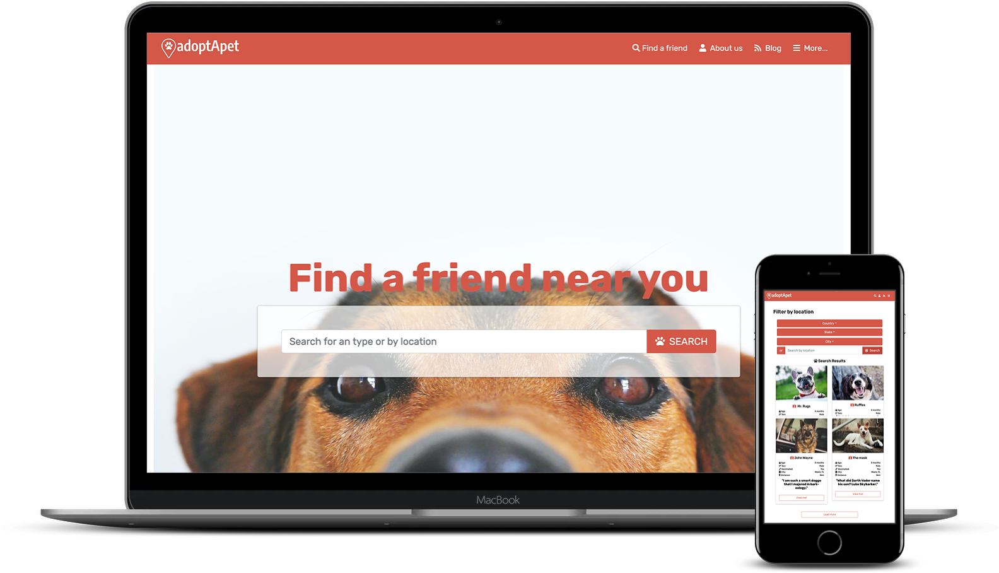

# Adopt a Pet adoption directory

 This website is a showcase for a pet adoption directory, the idea and the design are originals but inspired by the [design of Mathew Njuguna and others on Behance]([https://www.behance.net/gallery/25563385/PatashuleKE](https://www.behance.net/gallery/25563385/PatashuleKE)). 

Three pages were built: landing page, search results and selected result.

## Screenshots

## Built With

The project is built using HTML and CSS, SASS and the Bootstrap framework.

## Live Demo

🔗 [Live Demo Link](https://lirad.github.io/pet-adoption-directory/)

## To get a local copy up and running follow these simple example steps.

### Setup

Clone the project locally.

### Linters

1. run `npm install`.
2. run `npm run test` to check the HTML and CSS files.

### Deployment

Install and run a live server plugin on you IDE/Text editor and run it from the root directory.
If want to edit the files using SASS compiler:

1. Install a SASS processor;
2. Run `npm install`;
3. Run `sass --watch node_modules/bootstrap/scss:dist/bootstrap scss:dist/bootstrap`;

And edit the `scss/custom.scss` file.

## Authors

👤 **Diego Lira**

- Github: [@githubhandle](https://github.com/lirad)
- Twitter: [@twitterhandle](https://twitter.com/lirad)
- Linkedin: [linkedin](https://www.linkedin.com/in/diegoalira/)

## 📸 Photos credits

All the pictures were taken from [Pexels](https://pexels.com) and done by the following artists:

https://www.instagram.com/elum3a/
https://www.instagram.com/dominika_roseclay/
https://www.instagram.com/UPTHEBOOHAI/
https://www.instagram.com/dpopbes/
https://www.instagram.com/marcelochagasfotografia/

A big THANK YOU for you work!

## Show your support

Give a ⭐️ if you like this project!

## 📝 License

This project is [MIT](lic.url) licensed.
